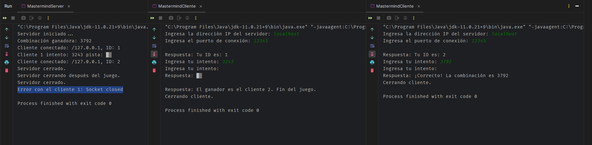

# Juego Mastermind

1. IP = localhost (default)
2. Puerto = 12345

Este juego es una variación del juego mastermind, ya que en vez de colores he usado números.
La idea del juego es que el servidor genere una combinación de 4 números aleatorios, la cual los usuarios tendrán que ir
averiguando con 10 intentos cada uno. En el juego se pueden ir sumando jugadores a una partida ya iniciada, esa sería una mejora
de cara a otro sprint, también que cada jugador tenga su turno respectivo, para poder mejorar el flujo de jugadores, pero de cara a algo funcional y es lo que pedía el enunciado.

Como podemos ver, una vez terminar el juego porque 1 jugador a sido el ganador se cierran todos, pero en el servidor aparece

_Error con el cliente 1: Socket closed_, esto no es un error como tal, ya que los jugadores y el servidor se cierran sin problema. El problema
realmente es que al haber un jugar que ha ganado y el otro jugador después de su primer intento no ha hecho más intento, el servidor está todavía a la espera
de que el jugador envía su petición es por eso que hay ese problema, porque el sockets se ha cerrado abruptamente, ya que como he dicho el servidor está escuchando
por el jugador 1. Pero todo funciona correctamente.